# Mark9 — Product Requirements Document

> **A WYSIWYG Markdown Editor by tofu9**
> Version: 0.1.0 (Initial Draft)
> Date: 2025-02-25

---

## 1. 제품 개요

**Mark9**은 GitHub Flavored Markdown(GFM)을 지원하는 WYSIWYG 마크다운 에디터입니다.
Typora처럼 렌더링된 결과를 직접 보면서 편집하는 것이 기본 모드이며, 필요 시 소스코드 보기로 전환할 수 있습니다.

### 1.1 핵심 가치

| 가치 | 설명 |
|------|------|
| **WYSIWYG 우선** | 소스코드가 아닌 렌더링된 문서를 직접 편집 |
| **Mermaid 네이티브** | 다이어그램을 실시간 렌더링하며 편집 |
| **Git 네이티브** | `.git`이 있는 디렉토리에서 자연스럽게 동기화 |
| **크로스 플랫폼** | Web + 데스크톱(Electrobun)으로 동일 경험 제공 |

### 1.2 타겟 사용자

- 마크다운으로 기술 문서를 작성하는 개발자
- README, 위키, 블로그를 관리하는 테크 리더
- 다이어그램이 포함된 설계 문서를 자주 쓰는 엔지니어

---

## 2. 시스템 아키텍처

### 2.1 전체 구조

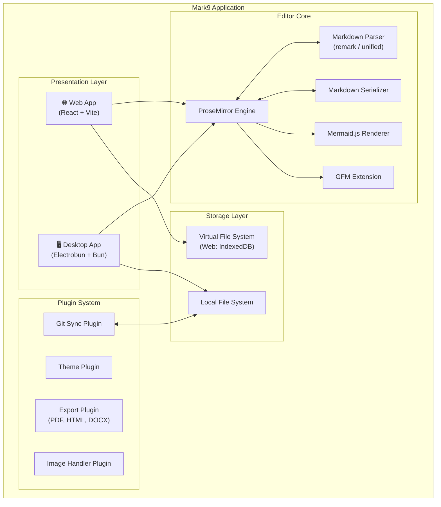

### 2.2 에디터 코어 아키텍처

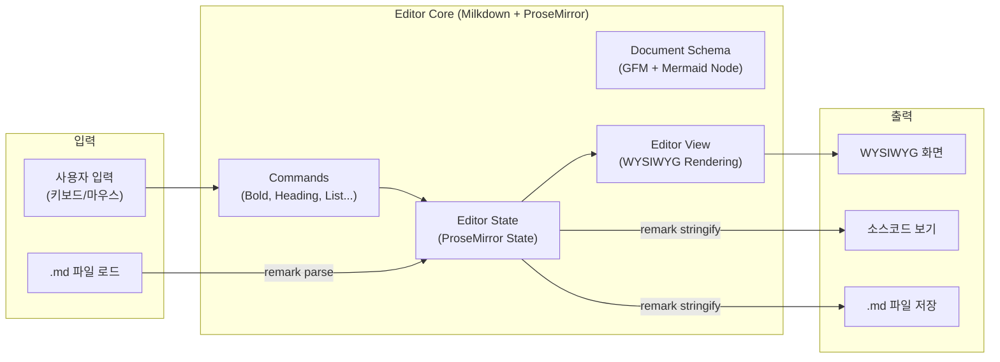

---

## 3. 기술 스택

### 3.1 핵심 기술 선정

| 영역 | 기술 | 선정 사유 |
|------|------|----------|
| **에디터 엔진** | Milkdown (ProseMirror 기반) | 마크다운 WYSIWYG에 특화, 플러그인 아키텍처, Typora에서 영감받은 설계 |
| **마크다운 파싱** | remark / unified | GFM 완벽 지원, AST 기반 변환, 확장성 |
| **다이어그램** | Mermaid.js | 마크다운 코드블록 내 다이어그램 표준 |
| **프론트엔드** | React 19 + TypeScript | 컴포넌트 기반 UI, 타입 안전성 |
| **빌드 도구** | Vite | 빠른 HMR, 번들 최적화 |
| **스타일링** | Tailwind CSS 4 | 미니멀 디자인 시스템, 빠른 스타일링 |
| **데스크톱** | Electrobun | Bun 런타임, 시스템 웹뷰, ~14MB 번들, 50ms 이하 시작 |
| **상태 관리** | Zustand | 경량, ProseMirror 상태와 분리된 앱 상태 관리 |
| **Git 연동** | isomorphic-git | 순수 JS git 구현, 브라우저/Node.js 양쪽 동작 |
| **테스트** | Vitest + Playwright | 단위 테스트 + E2E 테스트 |

### 3.2 Milkdown 선정 근거

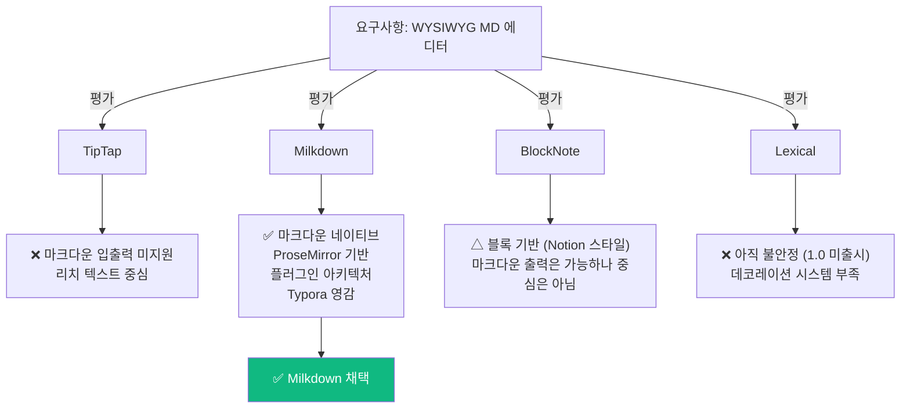

---

## 4. 핵심 기능 상세

### 4.1 편집 모드

#### WYSIWYG 모드 (기본)

- 렌더링된 문서를 직접 편집
- 마크다운 문법 입력 시 즉시 변환 (예: `##` 입력 → H2 헤딩으로 변환)
- 인라인 서식: Bold, Italic, Strikethrough, Code, Link
- 블록 요소: Heading(1-6), Blockquote, Code Block, Table, List, Task List, HR
- 이미지: 드래그앤드롭, 클립보드 붙여넣기, URL 삽입

#### 소스코드 모드 (토글)

- Raw 마크다운 텍스트 편집
- 구문 하이라이팅 (CodeMirror 6)
- WYSIWYG ↔ Source 전환 시 커서 위치 유지
- 단축키: `Ctrl/Cmd + /` 로 토글

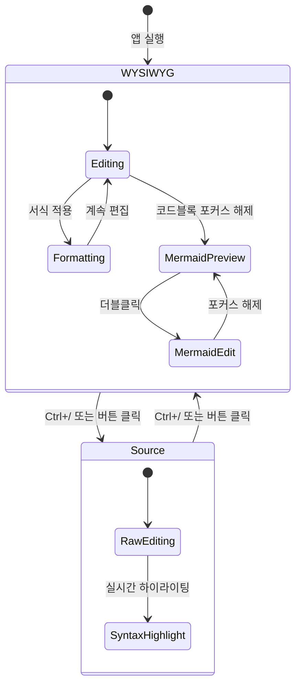

### 4.2 GFM (GitHub Flavored Markdown) 지원

| 기능 | 문법 | 지원 |
|------|------|------|
| 테이블 | `\| col \| col \|` | ✅ WYSIWYG 테이블 에디터 |
| Task List | `- [x] item` | ✅ 체크박스 클릭 가능 |
| Strikethrough | `~~text~~` | ✅ |
| Autolink | `https://...` | ✅ 자동 링크 변환 |
| 각주 | `[^1]` | ✅ |
| 수식 (KaTeX) | `$inline$`, `$$block$$` | ✅ (확장) |

### 4.3 Mermaid.js 다이어그램

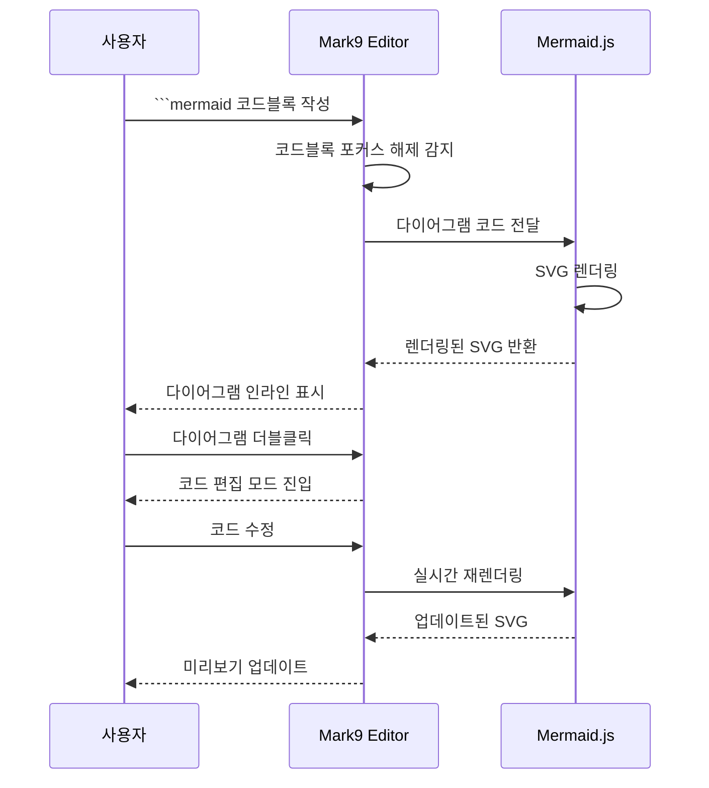

**지원 다이어그램 종류:**

- Flowchart, Sequence, Class, State, ER, Gantt
- Pie, Quadrant, Git Graph, Mindmap, Timeline
- 사용자 정의 테마 (Mark9 기본 테마 제공)

**편집 UX:**

- 포커스 해제 시: SVG 렌더링 표시
- 더블클릭 시: 코드 편집 + 실시간 미리보기 (split view)
- 에러 시: 에러 메시지 인라인 표시, 마지막 정상 SVG 유지
- SVG 우클릭 → 이미지로 내보내기 (PNG/SVG)

### 4.4 파일 관리

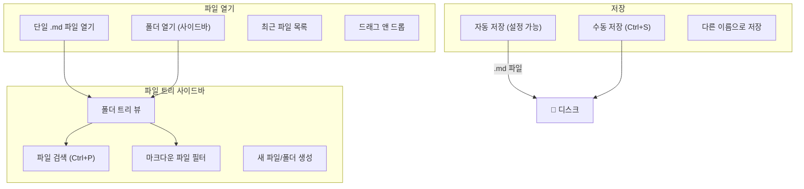

---

## 5. Git 연동 플러그인

### 5.1 개요

`.git`이 존재하는 디렉토리를 감지하여 Git 동기화 기능을 자동 활성화합니다.
별도의 Git 클라이언트 없이 Mark9 내에서 문서의 버전 관리가 가능합니다.

### 5.2 기능 흐름

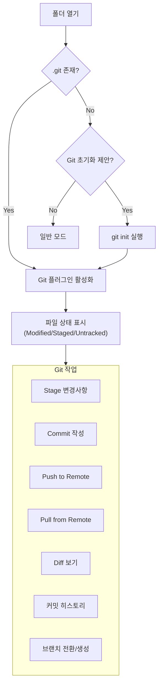

### 5.3 Git UI 구성

| 위치 | 기능 |
|------|------|
| **사이드바 아이콘** | Git 패널 열기/닫기 |
| **파일 트리** | 변경 상태 아이콘 (M, U, A, D) |
| **에디터 거터** | 라인별 변경 표시 (추가: 초록, 삭제: 빨강, 수정: 파랑) |
| **하단 상태바** | 현재 브랜치명, 동기화 상태 |
| **Git 패널** | Staged/Unstaged 파일 목록, Commit 메시지 입력, Push/Pull 버튼 |

### 5.4 리모트 설정

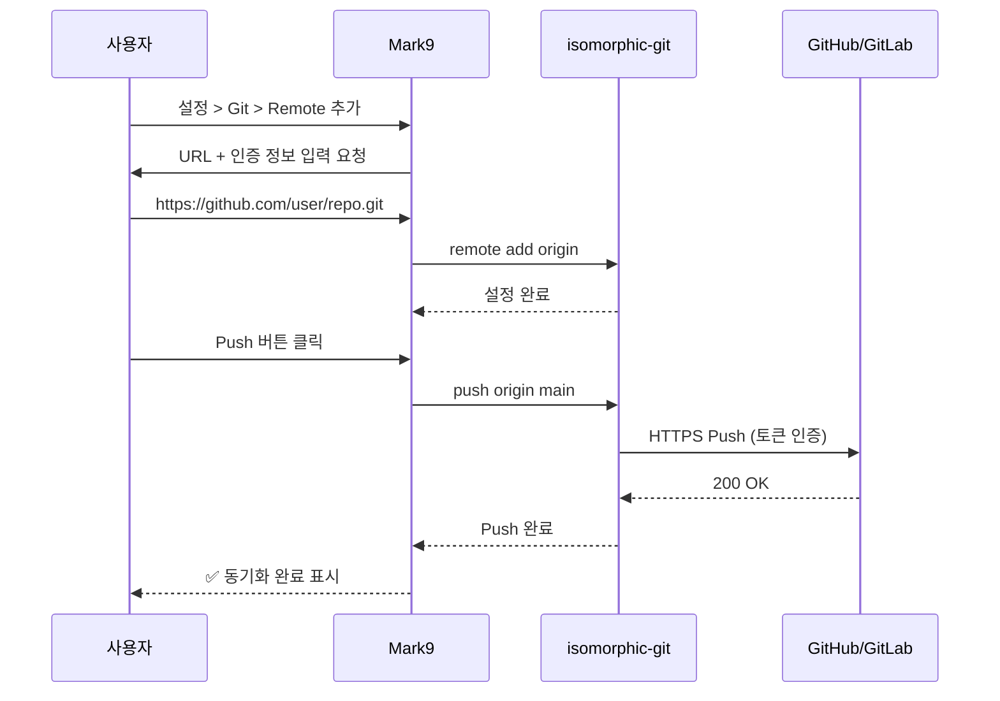

---

## 6. 플러그인 시스템

### 6.1 아키텍처

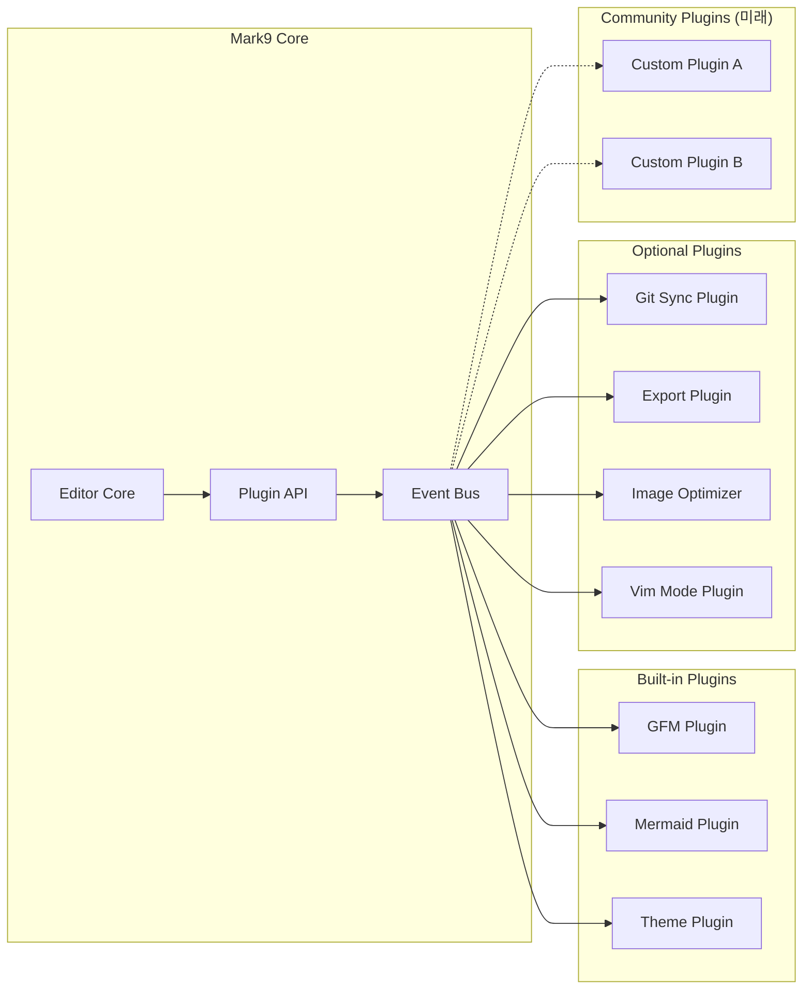

### 6.2 Plugin API (개념)

```typescript
interface Mark9Plugin {
  name: string;
  version: string;
  
  // 라이프사이클
  activate(context: PluginContext): void;
  deactivate(): void;
  
  // 선택적 확장 포인트
  editorExtensions?: MilkdownPlugin[];   // 에디터 확장
  sidebarPanels?: SidebarPanel[];        // 사이드바 패널
  commands?: Command[];                  // 커맨드 팔레트 명령
  statusBarItems?: StatusBarItem[];      // 상태바 아이템
  settings?: SettingSchema[];            // 설정 스키마
}
```

---

## 7. UI/UX 설계

### 7.1 레이아웃

```
┌─────────────────────────────────────────────────────┐
│  ☰  Mark9          filename.md         ─ □ ✕        │  ← 타이틀 바
├──────┬──────────────────────────────────┬────────────┤
│      │                                 │            │
│  📁  │   # Heading 1                   │  Outline   │
│      │                                 │            │
│ docs │   Lorem ipsum dolor sit amet,   │  - H1      │
│ ├ a  │   consectetur adipiscing elit.  │    - H2    │
│ ├ b  │                                 │    - H2    │
│ └ c  │   ```mermaid                    │  - H1      │
│      │   ┌──────────────────┐          │            │
│  🔀  │   │  ┌───┐   ┌───┐  │          │            │
│      │   │  │ A │──▶│ B │  │          │            │
│      │   │  └───┘   └───┘  │          │            │
│      │   └──────────────────┘          │            │
│      │                                 │            │
├──────┴──────────────────────────────────┴────────────┤
│  main ↑0 ↓0  │  Ln 42, Col 15  │  GFM  │  UTF-8    │  ← 상태바
└─────────────────────────────────────────────────────┘
     │                  │                      │
  사이드바         메인 에디터            아웃라인 패널
```

### 7.2 테마

| 테마 | 설명 |
|------|------|
| **Mark9 Light** | 기본 라이트 테마, GitHub 스타일 마크다운 렌더링 |
| **Mark9 Dark** | 다크 모드, 눈 피로 감소 |
| **Mark9 Sepia** | 세피아 톤, 장시간 글쓰기용 |

### 7.3 단축키

| 기능 | macOS | Windows/Linux |
|------|-------|---------------|
| 새 파일 | `⌘ N` | `Ctrl+N` |
| 파일 열기 | `⌘ O` | `Ctrl+O` |
| 저장 | `⌘ S` | `Ctrl+S` |
| 소스/WYSIWYG 토글 | `⌘ /` | `Ctrl+/` |
| 커맨드 팔레트 | `⌘ ⇧ P` | `Ctrl+Shift+P` |
| 파일 검색 | `⌘ P` | `Ctrl+P` |
| Bold | `⌘ B` | `Ctrl+B` |
| Italic | `⌘ I` | `Ctrl+I` |
| 링크 삽입 | `⌘ K` | `Ctrl+K` |
| 사이드바 토글 | `⌘ ⇧ E` | `Ctrl+Shift+E` |
| 아웃라인 토글 | `⌘ ⇧ O` | `Ctrl+Shift+O` |
| Git 패널 | `⌘ ⇧ G` | `Ctrl+Shift+G` |

---

## 8. 크로스 플랫폼 전략

### 8.1 공유 코드 vs 플랫폼 전용 코드

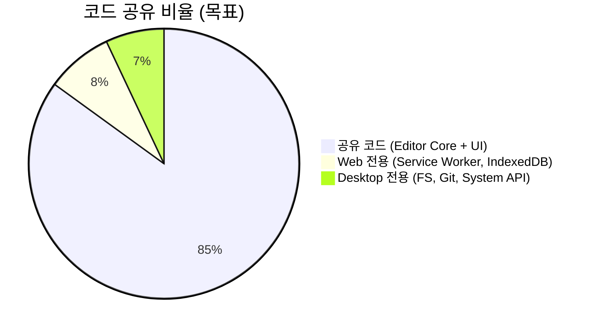

### 8.2 플랫폼별 차이

| 기능 | Web | Desktop (Electrobun) |
|------|-----|---------------------|
| 파일 시스템 | File System Access API (제한적) | 네이티브 FS (전체 접근) |
| Git 연동 | isomorphic-git (메모리) | isomorphic-git + 네이티브 fs |
| 자동 업데이트 | N/A (항상 최신) | Electrobun bsdiff 업데이트 (~14KB) |
| 오프라인 | Service Worker 캐시 | 완전 오프라인 |
| 성능 | 브라우저 엔진 의존 | 시스템 웹뷰 + Bun 런타임 |
| 번들 크기 | N/A | ~14MB |

### 8.3 Electrobun 데스크톱 구조

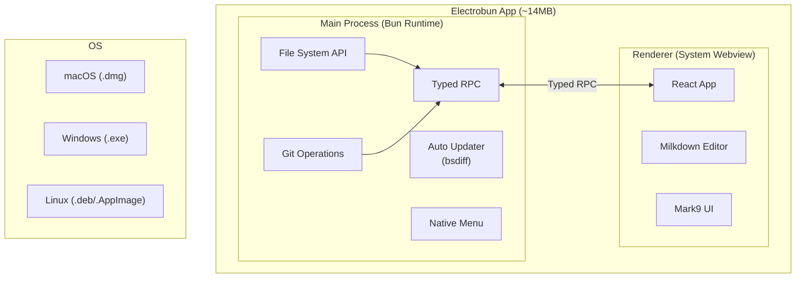

---

## 9. 프로젝트 구조

```
mark9/
├── packages/
│   ├── core/                    # 에디터 코어 (공유)
│   │   ├── src/
│   │   │   ├── editor/          # Milkdown 에디터 설정
│   │   │   ├── plugins/         # 빌트인 플러그인
│   │   │   │   ├── mermaid/     # Mermaid 렌더링
│   │   │   │   ├── gfm/        # GFM 확장
│   │   │   │   └── source-view/ # 소스코드 보기
│   │   │   ├── schema/          # ProseMirror 스키마
│   │   │   └── utils/           # 유틸리티
│   │   └── package.json
│   │
│   ├── ui/                      # 공유 UI 컴포넌트
│   │   ├── src/
│   │   │   ├── components/      # 사이드바, 상태바, 툴바 등
│   │   │   ├── layouts/         # 레이아웃
│   │   │   ├── themes/          # 테마 정의
│   │   │   └── hooks/           # React 훅
│   │   └── package.json
│   │
│   ├── plugin-git/              # Git 연동 플러그인
│   │   ├── src/
│   │   │   ├── git-operations.ts
│   │   │   ├── git-panel.tsx
│   │   │   └── index.ts
│   │   └── package.json
│   │
│   └── plugin-export/           # 내보내기 플러그인
│       └── ...
│
├── apps/
│   ├── web/                     # Web 앱
│   │   ├── src/
│   │   │   ├── App.tsx
│   │   │   ├── sw.ts            # Service Worker
│   │   │   └── platform/        # Web 전용 로직
│   │   ├── index.html
│   │   ├── vite.config.ts
│   │   └── package.json
│   │
│   └── desktop/                 # Electrobun 데스크톱 앱
│       ├── src/
│       │   ├── main.ts          # Bun main process
│       │   ├── rpc/             # Typed RPC 정의
│       │   └── platform/        # Desktop 전용 로직
│       ├── views/
│       │   └── mainview/        # Webview (React 앱)
│       └── package.json
│
├── turbo.json                   # Turborepo 설정
├── package.json                 # Workspace root
└── README.md
```

---

## 10. 개발 로드맵

### 10.1 마일스톤

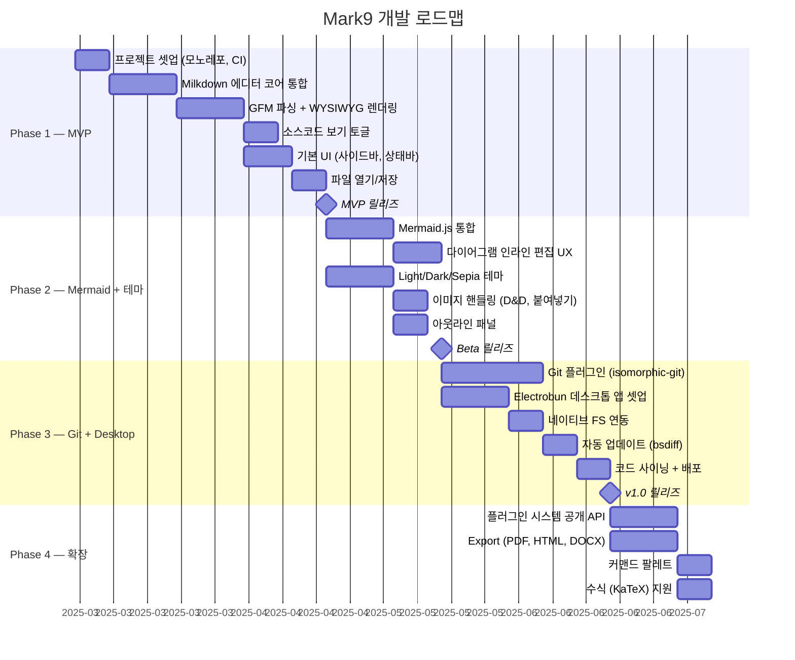

### 10.2 Phase별 목표

| Phase | 기간 | 목표 | 산출물 |
|-------|------|------|--------|
| **Phase 1 — MVP** | 약 8주 | GFM WYSIWYG 편집, 파일 관리 | Web 앱 (alpha) |
| **Phase 2 — Mermaid** | 약 5주 | Mermaid 다이어그램, 테마, 이미지 | Web 앱 (beta) |
| **Phase 3 — Git + Desktop** | 약 7주 | Git 플러그인, Electrobun 앱 | Web + Desktop v1.0 |
| **Phase 4 — 확장** | 약 5주 | 플러그인 API, Export, KaTeX | v1.x |

---

## 11. 비기능 요구사항

### 11.1 성능 목표

| 지표 | 목표 |
|------|------|
| 초기 로딩 | < 1초 (Web), < 500ms (Desktop) |
| 타이핑 지연 | < 16ms (60fps) |
| 대용량 파일 | 10,000줄 이상 .md 파일 원활 편집 |
| Mermaid 렌더링 | < 200ms (일반적 다이어그램) |
| 메모리 사용 | < 200MB (데스크톱 앱) |
| 번들 크기 | < 2MB (Web gzip), ~14MB (Desktop) |

### 11.2 접근성

- 키보드 네비게이션 완전 지원
- 스크린 리더 호환 (ARIA labels)
- 고대비 모드 지원
- 시스템 다크 모드 자동 감지

### 11.3 보안

- 로컬 파일만 직접 접근 (Web은 File System Access API 범위 내)
- Git 인증 정보는 시스템 키체인/자격 증명 관리자에 저장
- Mermaid SVG 렌더링 시 XSS 방지 (DOMPurify)
- 데스크톱 앱: Electrobun의 프로세스 격리 활용

---

## 12. 경쟁 분석

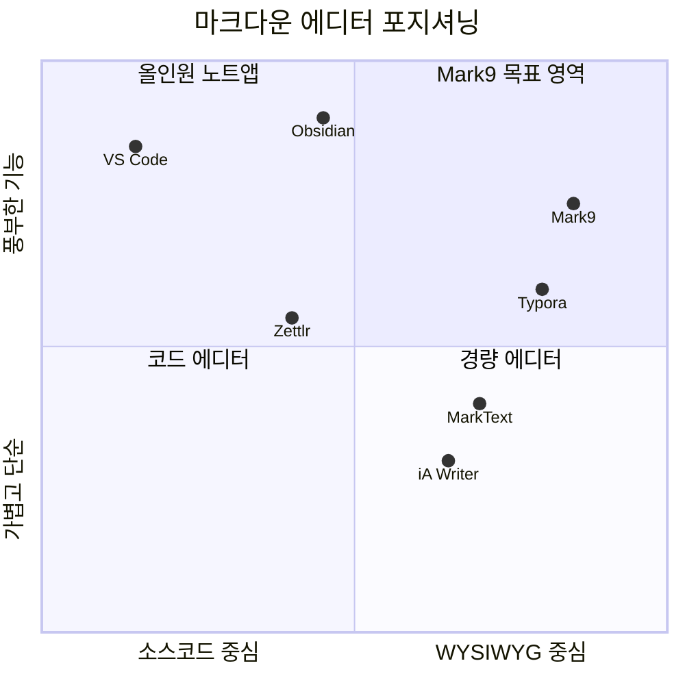

### 12.1 Mark9 차별점

| vs | Mark9 장점 |
|----|-----------|
| **Typora** | 오픈소스, Git 네이티브 연동, Mermaid 편집 UX, 플러그인 시스템 |
| **Obsidian** | 순수 마크다운 중심 (독자 문법 없음), 가벼운 번들, WYSIWYG 기본 |
| **MarkText** | 더 적극적인 유지보수, Electrobun(경량), 모던 스택 |
| **VS Code** | 마크다운 편집 전용 UX, 학습 곡선 없음, WYSIWYG 기본 |

---

## 13. 브랜딩

| 항목 | 내용 |
|------|------|
| **제품명** | Mark9 |
| **제작자** | tofu9 |
| **태그라인** | *Markdown editor. Sharp & simple.* |
| **도메인 후보** | mark9.dev, mark9.app |
| **라이선스** | MIT (코어) / 데스크톱 앱은 추후 결정 |
| **로고 컨셉** | "M" + "9" 결합, 미니멀 지오메트릭 |

---

## 부록 A: 기술 의사결정 기록 (ADR)

### ADR-001: 에디터 엔진으로 Milkdown 채택

- **상태:** 승인
- **맥락:** WYSIWYG 마크다운 에디터의 핵심 엔진 선택
- **결정:** Milkdown (ProseMirror 기반)
- **근거:** 마크다운 입출력이 1급 시민, 플러그인 아키텍처, Typora 영감 설계
- **대안:** TipTap (마크다운 비네이티브), BlockNote (블록 중심), Lexical (불안정)

### ADR-002: 데스크톱 프레임워크로 Electrobun 채택

- **상태:** 승인
- **맥락:** 크로스 플랫폼 데스크톱 앱 프레임워크 선택
- **결정:** Electrobun
- **근거:** ~14MB 번들 (Electron 대비 1/10), <50ms 시작, TypeScript 네이티브, Bun 런타임, bsdiff 업데이트
- **대안:** Electron (150MB+), Tauri (Rust 필요), Neutralino (기능 제한)
- **리스크:** Electrobun v1 출시 직후로 생태계가 아직 작음. 필요시 Tauri fallback 고려

### ADR-003: Git 연동에 isomorphic-git 채택

- **상태:** 승인
- **맥락:** Web/Desktop 양쪽에서 동작하는 Git 구현 필요
- **결정:** isomorphic-git
- **근거:** 순수 JS, 브라우저/Node.js 양쪽 동작, MIT 라이선스
- **제한:** 일부 고급 Git 기능 미지원 (rebase, worktree 등)
